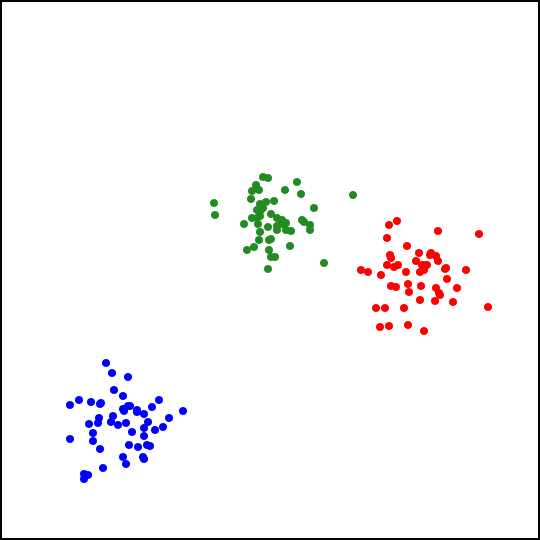
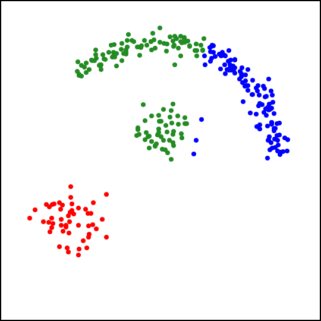
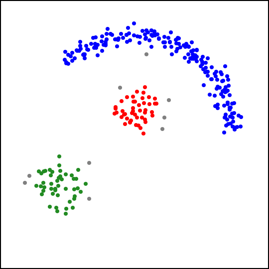

# clustering

Go implementations of the [DBSCAN](https://en.m.wikipedia.org/wiki/DBSCAN) and
[k-means](https://en.m.wikipedia.org/wiki/K-means_clustering) clustering algorithms, the [k-d
tree](https://en.m.wikipedia.org/wiki/K-d_tree) spatial index and some functions to generate and
visualize sample data.

## Example Output

Below are two examples that show the algorithms in action. In the output, clusters are indicated by
colors; points shown in gray were marked as noise.

The first example is 150 points clustered by k-means:

and DBSCAN:

The second example includes a cluster of points distributed in a non-convex shape. K-means doesn't
recognize it:

but DBSCAN does:

