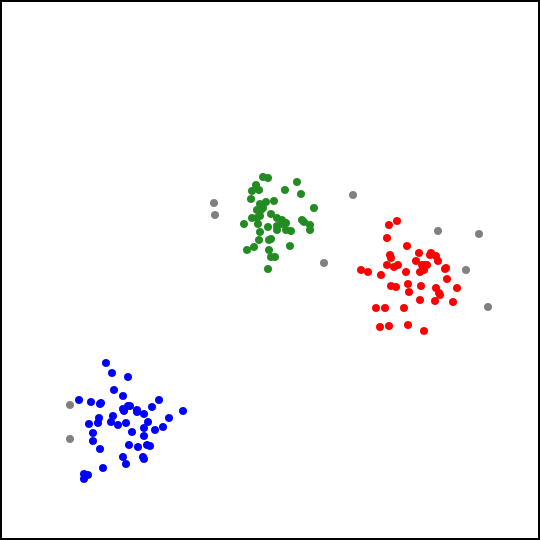

# clustering

Implementations in Go of the [DBSCAN](https://en.m.wikipedia.org/wiki/DBSCAN) clustering algorithm
for 2-D points, the [k-d tree](https://en.m.wikipedia.org/wiki/K-d_tree) spatial index and some
functions to generate and visualize sample data.

Below is an example of a set of 150 points grouped into three clusters with DBSCAN (the gray points
were marked as noise):

